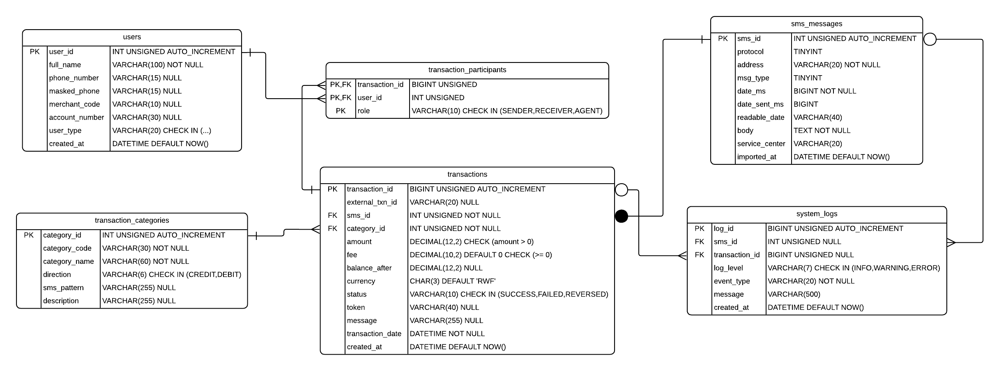

# MoMo SMS Data Analysis

A fullstack application that processes MTN MoMo SMS data from XML, cleans and
categorizes it, stores it in a MySQL database, and visualizes it on a dashboard.

## Team

| Name | Role |
|---|---|
| Ishimwe Fabrice | Repo & scaffolding |
| Bagabo Lewis | Data & database |
| Kamuzinzi Ian | Frontend & data contract |
| Keza Dana | Architecture & docs |
| Nyange Digne | Process & board |

## Links

- Architecture diagram: [View on Miro](https://miro.com/app/board/uXjVHpncxSU=/?share_link_id=874764227081)
- Trello board: [The Trello Board](https://trello.com/invite/b/6a9acac8c426fce02848749d/ATTI69aed775d344ef2fae688f4cdcccac6a69035B78/my-trello-board)

## Setup

```bash
git clone https://github.com/ixhm-brix/momo-sms.git
cd momo-sms
python -m venv .venv && source .venv/bin/activate
pip install -r requirements.txt
cp .env.example .env
```

Place the provided `momo.xml` in `data/raw/`. It is git-ignored — each team
member obtains it separately and never commits it.

### Database

Requires MySQL 8.0.16 or later (earlier versions parse `CHECK` constraints but
do not enforce them).

```bash
mysql -u root -p < database/database_setup.sql
```

This creates the `momo_sms_db` database, its tables, constraints and indexes,
and loads the sample data.

## Run

```bash
bash scripts/run_etl.sh        # parse -> clean -> categorize -> load -> export
bash scripts/serve_frontend.sh # then open http://localhost:8000
```

The ETL modules, API and dashboard scripts are scaffolded and will be
implemented in upcoming weeks.

## Project structure

```
database/  MySQL schema and sample data (database_setup.sql)
docs/      ERD and architecture diagrams
examples/  JSON representations of the database entities
etl/       Parse, clean, categorize, load
data/      Raw XML, processed JSON, logs
web/       Dashboard styles and scripts
api/       Optional FastAPI service
scripts/   Convenience runners
tests/     Unit tests
```

## Architecture


The application transforms unstructured MTN MoMo SMS notifications into
structured database records to expose financial patterns:

1. **Read (`data/raw/`):** Reads raw SMS nodes from `momo.xml`.
2. **Extract & transform (`etl/`):**
   - **Parse (`parse_xml.py`):** Loops over messages to extract sender metadata, timestamps and message bodies.
   - **Clean & normalize (`clean_normalize.py`):** Extracts amounts (e.g. `"2,000 RWF"` to `2000`), normalizes timestamps and unifies phone number formats.
   - **Categorize (`categorize.py`):** Matches message text against patterns to tag incoming money, merchant payments, transfers, bank deposits and airtime.
   - **Dead-letter handling:** Routes malformed, unexpected or promotional messages to `data/logs/dead_letter/` instead of crashing.
3. **Store (`database/`):** Writes clean records into the MySQL database so summaries can be computed without re-reading the XML.
4. **Display (`web/`):** Aggregates results into `data/processed/dashboard.json`, which feeds `index.html` and `chart_handler.js` to render charts and transaction metrics.

## Database Design

### Entity Relationship Diagram



The database `momo_sms_db` has six tables:

| Table | Purpose | Keys |
|---|---|---|
| `users` | Everyone who appears in a message: the account owner, other customers, agents and merchants | PK `user_id` |
| `sms_messages` | Each SMS exactly as imported from the XML, including the original body | PK `sms_id`, UNIQUE `date_ms` |
| `transaction_categories` | Lookup of transaction types and the SMS pattern that identifies each | PK `category_id`, UNIQUE `category_code` |
| `transactions` | One financial transaction parsed from an SMS | PK `transaction_id`, FK `sms_id`, FK `category_id`, UNIQUE `external_txn_id` |
| `transaction_participants` | Junction table linking users to transactions with a role | PK (`transaction_id`, `user_id`, `role`), both FKs |
| `system_logs` | Import and parsing events | PK `log_id`, FK `sms_id`, FK `transaction_id` (both optional) |

### Relationships

| Relationship | Cardinality | Enforced by |
|---|---|---|
| `transaction_categories` → `transactions` | 1:M | `transactions.category_id` NOT NULL FK |
| `sms_messages` → `transactions` | 1:1 (an SMS yields at most one transaction) | `transactions.sms_id` NOT NULL FK + UNIQUE |
| `transactions` ↔ `users` | M:N, resolved by `transaction_participants` | Composite PK and two FKs |
| `sms_messages` → `system_logs` | 1:M, optional | Nullable `system_logs.sms_id` FK |
| `transactions` → `system_logs` | 1:M, optional | Nullable `system_logs.transaction_id` FK |

### Design Decisions

We built the schema around the SMS message, because every transaction in the
dataset starts as one. `sms_messages` stores each message as it appears in the
XML, including the original body, so any parsed value can be traced back to its
source. The unique key on `date_ms` stops the same message being imported twice
when the XML is reloaded.

`transactions` holds only the values extracted from a message. Money columns use
`DECIMAL` rather than `FLOAT` so RWF amounts are stored exactly, and `CHECK`
constraints reject zero or negative amounts, negative fees and balances, and
invalid currency codes. The MoMo transaction ID is unique but nullable, because
some messages, such as bank deposits and transfers to mobile numbers, do not
include one.

Transaction types live in `transaction_categories` rather than a free-text
column. This keeps names consistent, lets us add a type without changing the
schema, and keeps the SMS pattern used to detect each type next to the category.

A transaction involves several people (a sender, a receiver, sometimes an
agent), and one person appears in many transactions. The
`transaction_participants` junction table resolves this many-to-many
relationship. Its primary key includes `role`, so one user can take part in a
transaction in more than one role. A single `users` table, with `user_type`
distinguishing customers, agents and merchants, avoids repeating contact details.

`system_logs` has optional links to messages and transactions, so it can record
batch-level events as well as problems with a single message. Indexes cover the
lookups we expect most: phone numbers, date ranges, category and status filters,
a user's transactions, and logs by severity.

### Constraints and Indexes

**CHECK constraints**

| Table | Rule |
|---|---|
| `transaction_categories` | `direction` is `CREDIT` or `DEBIT` |
| `users` | `user_type` is one of the allowed types; `phone_number` is 10–12 digits |
| `transactions` | `amount > 0`; `fee >= 0`; `balance_after >= 0`; `status` is `SUCCESS`, `FAILED` or `REVERSED`; `currency` is three uppercase letters |
| `transaction_participants` | `role` is `SENDER`, `RECEIVER` or `AGENT` |
| `system_logs` | `log_level` is `INFO`, `WARNING` or `ERROR` |

**Indexes**

| Index | Columns | Supports |
|---|---|---|
| `idx_users_phone` | `users(phone_number)` | Finding a sender or receiver by phone number |
| `idx_tx_date` | `transactions(transaction_date DESC)` | Statements and date-range queries, newest first |
| `idx_tx_category_status` | `transactions(category_id, status)` | Filtering by category and status |
| `idx_participants_user` | `transaction_participants(user_id)` | A user's transaction history |
| `idx_logs_level_created` | `system_logs(log_level, created_at DESC)` | Filtering logs by severity and time |

## JSON Data Modeling

The `examples/` folder shows how each table is serialized to JSON and how
related rows are nested for API responses.

| File | Contents |
|---|---|
| [`users.json`](examples/users.json) | One `users` row |
| [`sms_messages.json`](examples/sms_messages.json) | One `sms_messages` row |
| [`transaction_categories.json`](examples/transaction_categories.json) | One `transaction_categories` row |
| [`transactions.json`](examples/transactions.json) | One `transactions` row, with foreign keys as plain IDs |
| [`transaction_participants.json`](examples/transaction_participants.json) | The junction rows for one transaction |
| [`system_logs.json`](examples/system_logs.json) | One `system_logs` row |
| [`complete_transaction.json`](examples/complete_transaction.json) | A full transaction with its category, participants (including user details) and source SMS nested inside |
| [`api_transaction_response.json`](examples/api_transaction_response.json) | The complete transaction wrapped in an API response envelope |
| [`json_examples.json`](examples/json_examples.json) | All entities, a nested transaction including its logs, and an API response in a single file |

### SQL-to-JSON Mapping

Tables are normalized in SQL to avoid duplication. In an API response, foreign
keys are replaced by the related rows, nested as objects or arrays:

| SQL table | JSON representation | How it is nested |
|---|---|---|
| `transactions` | Root object | `category_id` and `sms_id` are replaced by the nested objects below |
| `transaction_categories` | `category` | Many-to-one, so a single object |
| `transaction_participants` | `participants[]` | Junction rows become an array; each item keeps its `role` |
| `users` | `participants[].user` | Nested inside each participant |
| `sms_messages` | `sms` | One-to-one, so a single object |
| `system_logs` | `logs[]` | One-to-many, so an array |

| SQL type | JSON type |
|---|---|
| `INT`, `BIGINT`, `TINYINT`, `DECIMAL` | number |
| `VARCHAR`, `CHAR`, `TEXT` | string |
| `DATETIME` | string, e.g. `"2024-05-10 16:30:51"` |
| `NULL` | `null` |

See [`examples/sql_json_mapping.md`](examples/sql_json_mapping.md) for a
field-by-field walkthrough.
