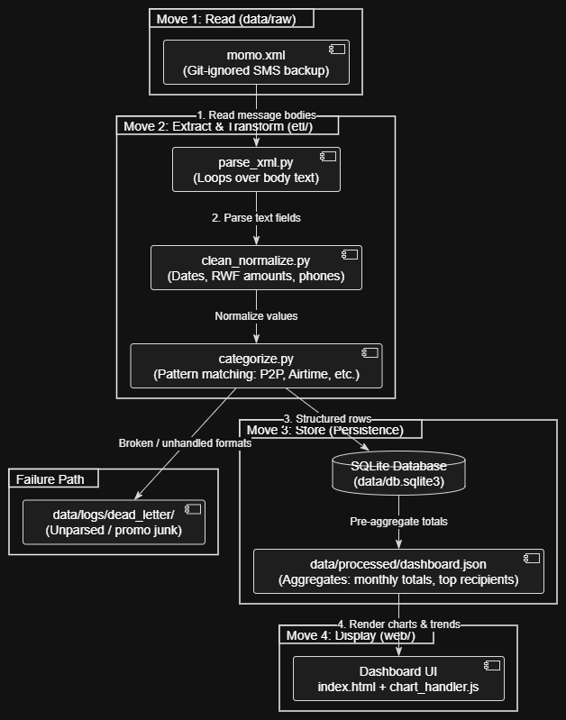

# MoMo SMS Data Analysis

Fullstack application that is used processes MTN MoMo SMS data from XML, cleans and
categorizes it, stores it in SQLite, and easily visualizes it on a dashboard.

## Team

| Name | Role |
|---|---|
| Ishimwe Fabrice | Repo & scaffolding |
| Bagabo Lewis | Data & database |
|Kamuzinzi Ian | Frontend & data contract |
|Keza Dana | Architecture & docs |
| Nyange Digne | Process & board |

## Links

- ## Links

- Architecture diagram: [View on Miro]https://miro.com/app/board/uXjVHpncxSU=/)
- Trello board: [The Trello Board](https://trello.com/invite/b/6a9acac8c426fce02848749d/ATTI69aed775d344ef2fae688f4cdcccac6a69035B78/my-trello-board).

## Setup

```bash
git clone <repo-url>
cd <repo>
python -m venv .venv && source .venv/bin/activate
pip install -r requirements.txt
cp .env.example .env
```

Place the provided `momo.xml` in `data/raw/`. It is git-ignored — each team
member obtains it separately and never commits it.

## Run

```bash
bash scripts/run_etl.sh        # parse -> clean -> categorize -> load -> export
bash scripts/serve_frontend.sh # then open http://localhost:8000
```

## Project structure

```
etl/      Parse, clean, categorize, load
data/     Raw XML, SQLite DB, processed JSON, logs
web/      Dashboard styles and scripts
api/      Optional FastAPI service
scripts/  Convenience runners
tests/    Unit tests
```

## Architecture



The application transforms unstructured MTN MoMo SMS notifications into structured database entries to expose financial patterns[cite: 1]:

1. **Move 1: Read (`data/raw/`):** Reads raw SMS text nodes from `momo.xml`[cite: 1].
2. **Move 2: Extract & Transform (`etl/`):**
   - **Parsing (`parse_xml.py`):** Loops over messages to extract sender metadata, timestamps, and message bodies[cite: 1].
   - **Clean & Normalize (`clean_normalize.py`):** Extracts currency amounts (e.g., `"2,000 RWF"` to `2000`), normalizes timestamps, and unifies telephone formats[cite: 1].
   - **Categorize (`categorize.py`):** Uses regex matching against text patterns to tag transfers, merchant pay, airtime, and cash-in/out[cite: 1].
   - **Dead-Letter Handling:** Routes corrupted, unexpected, or promotional junk to `data/logs/dead_letter/` to prevent crashes[cite: 1].
3. **Move 3: Store (`data/`):** Writes clean records into SQLite (`data/db.sqlite3`) so analytical summaries can be computed without re-reading the XML[cite: 1].
4. **Move 4: Display (`web/`):** Aggregates insights into `data/processed/dashboard.json`, feeding the interactive web interface (`index.html` and `chart_handler.js`) to render charts and transaction metrics[cite: 1].
